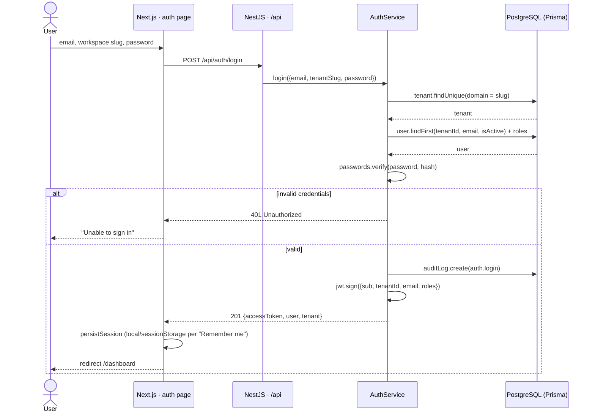
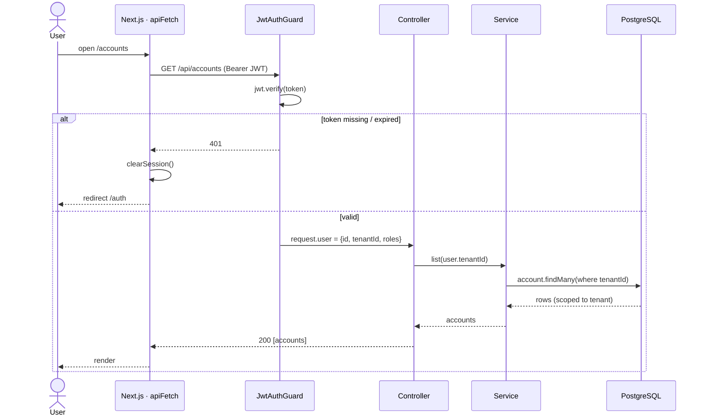
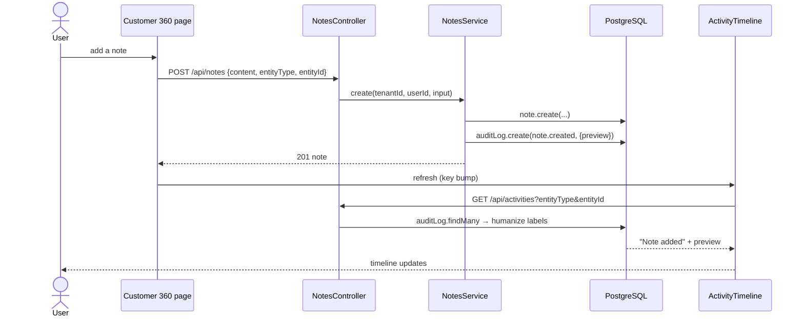
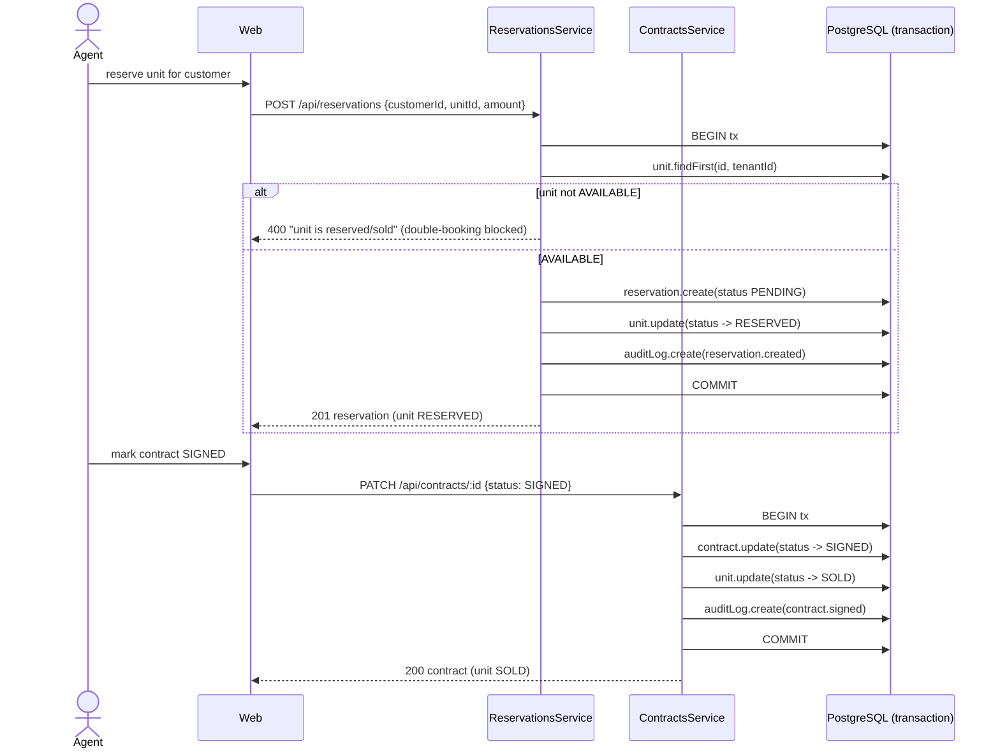
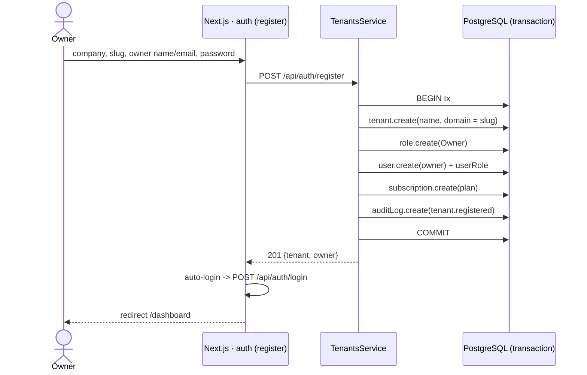

# BetFlow CRM — Sequence Diagrams

Multi-tenant real-estate CRM. Frontend: **Next.js** (`apps/web`). API: **NestJS** (`apps/api`,
served under `/api`). Data: **PostgreSQL via Prisma**. Auth: custom HMAC **JWT**.

**Common pattern:** the browser calls the API through `apiFetch` (`apps/web/src/lib/api.ts`),
which attaches `Authorization: Bearer <jwt>`. The API's `JwtAuthGuard` verifies the token and
exposes `request.user = {id, tenantId, roles}` (via the `@CurrentUser()` decorator). Controllers
delegate to services; every query is **scoped by `tenantId`**, and mutations write an `AuditLog`
row, which the **activity timeline** reads back (humanized).

## Legend

| Participant | Maps to |
|---|---|
| Web | `apps/web` client component + `apiFetch` |
| Guard | `common/guards/jwt-auth.guard.ts` + `auth/jwt.service.ts` |
| Controller / Service | `apps/api/src/<module>/*.controller.ts` / `*.service.ts` |
| DB | PostgreSQL through `PrismaService` |

---

## 1. Authentication (login)

## 2. Authenticated request pattern (tenant-scoped) + 401 handling

## 3. Create record → audit → activity timeline

## 4. Real-estate inventory state machine (reserve → sign)

## 5. Tenant registration (sign-up)

